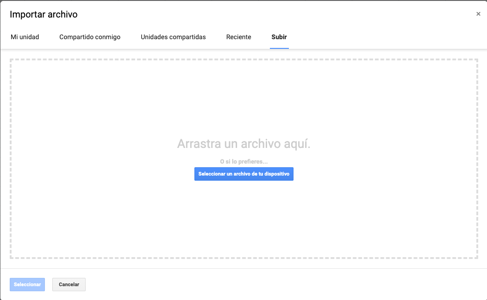
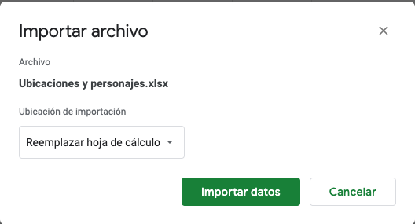
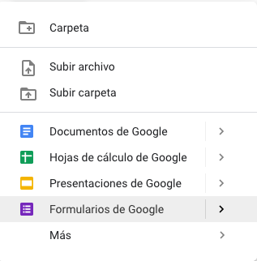
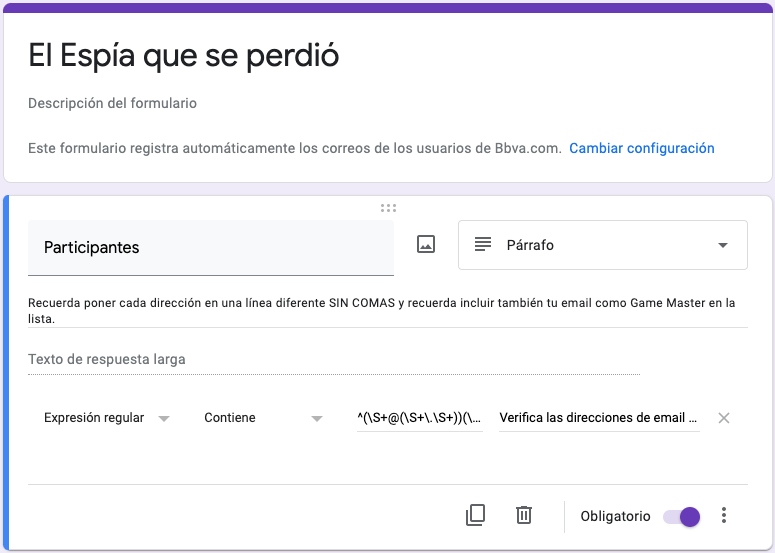
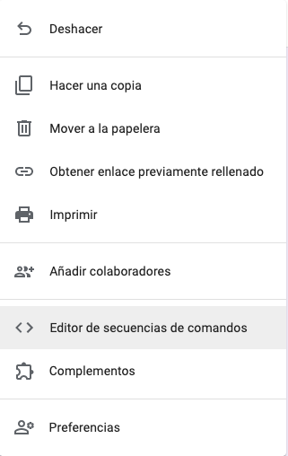

# ¿Cómo implementar el juego?

## 1.- Creación de una hoja de cálculo de Google 

Tienes que tener una cuenta de correo de Google válida (normalmente @gmail.com) y una vez tengas la sesión abierta tienes que visitar [Google Drive](https://drive.google.com)

Pulsa sobre el botón "Nuevo" y selecciona "Hoja de Calculo de Google".


Una vez la tengas tienes que pinchar sobre "Archivo" --> "Importar" y hay que seleccionar la opción "Subir"



Importante que cuando vayamos a importar le demos a la selección de Reemplazar hoja para que nos importe el fichero perfectamente



## 2.- Creación del formulario

Nos iremos otra vez a [Google Drive](https://drive.google.com) en una pestaña nueva.



Le ponemos el nombre que queramos al formulario, recomendación poner un nombre que nos ayude por ejemplo **El Espía que se perdió**

Vamos a crear un formulario con únicamente 1 repuesta y con un mensaje para que no se nos olvide que hay que incluir siempre los emails de todos los jugadores (incluido el GameMaster). Deberías tener algo así



Marcaremos la pregunta como obligatoria y le añadiremos la validación de tipo Expresión regular con el siguiente valor:

```regex
^(\S+@(\S+\.\S+))(\n\S+@(\S+\.\S+))*$
```

Esto verificará que cada email introducido es válido y está en una linea diferente.

Una vez esto esté completado le daremos a los 3 puntos verticales de arriba a la derecha y pulsaremos sobre "Editor de secuencia de comandos"



## 3.- El código Google App Script

Ahora estaremos en otra pestaña direferente en la que estaremos viendo un editor de código en Javascript, aquí deberemos pegar lo que está en el fichero Código.gs

```javascript
const subject = "Abre este email y descubre tu secreto para esta partida";
const sender = "EMAIL_DE_ENVIO"; // Usar solo si tienes un alias válido desde tu usuario de GSuite
const nameFrom = "Agencia Secreta"; 
let espiaHtmlBody = "";
let espiaBody = "La partida no ha hecho más que comenzar y este es el momento de que juegues tus mejores dotes deductivas y artimañas para acertar el escenario sin ser descubierto. Y si aún no has activado tus dotes deductivas solo confirmarte que efectivamente eres EL/LA ESPÍA.";
let restoHtmlBody = "";
let restoBody = "La partida no ha hecho más que comenzar y ahora es el momento de que lleves tus dotes interpretativas a otro nivel. El sistema te ha asignado el siguiente personaje 'ROL_PERSONAJE'.\n Este personaje pertenece al escenario 'ESCENARIO_ASIGNADO'.\nSi por alguna razón no lo conoces o quieres tener una referencia (la misma para todos los jugadores) aquí puedes ver una imagen del escenario: ESCENARIO_IMG_SRC"; 
var advancedOpts = { 
  name: subject, 
  name: nameFrom, 
  //replyTo: sender, 
  //from: sender
};

function onSubmit(e) {

  let itemResponses = e.response.getItemResponses();
  let jugadores = JSON.stringify(itemResponses[0].getResponse()).replace(/['"]+/g, '').split("\\n");
  nexters = shuffleArray(jugadores);
  Logger.log("Jugadores agitados: " + jugadores);

  let ssWebApp = SpreadsheetApp.openById(getFileByUrl("URL_HOJA_GOOGLE_SPREADSHEETS"));
  let workSheet = ssWebApp.getSheetByName("Personajes y Escenarios");

  // Obtenemos los escenarios
  let tabla = workSheet.getDataRange().getValues();
  // Obtenemos un número de escenario al azar
  let escenario_num = Math.floor( Math.random() * tabla.length );
  
  let escenario = tabla[escenario_num][0];
  let escenario_imagen = tabla[escenario_num][1];
  let personajes = tabla[escenario_num].slice(3);

  personajes = shuffleArray(personajes);
  // Agregamos al espía el primer jugador para garantizar que siempre está presente en la partida
  personajes = ["Espía"].concat(personajes);

  Logger.log("Escenario: " + tabla[escenario_num][0]);
  Logger.log("Url de la imagen del escenario: " + escenario_imagen);
  
  for (var i = 0; i < jugadores.length; i++){
    if (i == 0){ //Esto quiere decir que es el esía y por tanto no debe conocer el escenario

      // Para verificar que todo funciona puedes usar esta salida en el log, pero no lo uses para hacer trampas ya qu entonces perderá la gracia
      Logger.log("El jugador con el email '" + jugadores[i] + "' es el espía");

      advancedOpts.htmlBody = espiaHtmlBody
      GmailApp.sendEmail(jugadores[i], subject, espiaBody, advancedOpts);
    }else{

      // Para verificar que todo funciona puedes usar esta salida en el log, pero no lo uses para hacer trampas ya qu entonces perderá la gracia
      Logger.log("El jugador '" + jugadores[i] + "' ha obtenido el rol '" + personajes [i] + "', por tanto aquí tienes tu ubicación: '" + escenario + "' y por si no sabes nada de él además aquí tienes una foto: '" + escenario_imagen + "'.");
      var tmpRestoHtmlBody = restoHtmlBody;
      tmpRestoHtmlBody = tmpRestoHtmlBody.replaceAll('ROL_PERSONAJE', personajes [i]);
      tmpRestoHtmlBody = tmpRestoHtmlBody.replaceAll('ESCENARIO_ASIGNADO', escenario);
      tmpRestoHtmlBody = tmpRestoHtmlBody.replaceAll('ESCENARIO_IMG_SRC', escenario_imagen);
      
      restoBody = espiaBody.replaceAll('ROL_PERSONAJE', personajes [i]);
      restoBody = espiaBody.replaceAll('ESCENARIO_ASIGNADO', escenario);
      restoBody = espiaBody.replaceAll('ESCENARIO_IMG_SRC', escenario_imagen);
      
      // Actualizamos el cuerpo del email. Aquí hacemos un envío a cada jugador
      advancedOpts.htmlBody = tmpRestoHtmlBody;
      GmailApp.sendEmail(jugadores[i], subject, restoBody, advancedOpts);
    }
  }
  
}

// Función para reordenar de forma aleatoria el array que reciba (usado para jugadores y personajes)
function shuffleArray(array){
  return array.sort((a, b) => 0.5 - Math.random());;
}

// Función auxiliar para ayudar a obtener el identificador del archivo
function getFileByUrl(url){ return url.match(/[-\w]{25,}/); }
```

Una vez esté el código tendrás que ir a la pestaña donde tenías la hoja de cálculo del paso 1 y coger el identificador del archivo. Este identificador es parte de su URL. Ejemplo
```
https://docs.google.com/spreadsheets/d/1uklxKrE8JEJJYqwfskE7FwL8ct_q7p1aA9EdcWL1Es0/edit#gid=1697546335
```

Este fichero tiene el siguiente ID:
```javascript
1uklxKrE8JEJJYqwfskE7FwL8ct_q7p1aA9EdcWL1Es0
```
Es básicamente lo que está entre **/d/** y **/edit** dentro de la URL. Este ID lo pondremos en donde está la línea:
```javascript
  let ssWebApp = SpreadsheetApp.openById("IDENTIFICADOR_HOJA_GOOGLE_SPREADSHEETS");
```
Quedando de la siguiente manera:
```javascript
  let ssWebApp = SpreadsheetApp.openById("1uklxKrE8JEJJYqwfskE7FwL8ct_q7p1aA9EdcWL1Es0");
```

## 4.- Ficheros HTML

Tendremos que crear 2 ficheros HTML **espia_email_body.html** y **jugador_email_body**.

Deberemos incluir el contenido de estos ficheros en los respectivos que hayamos creado

